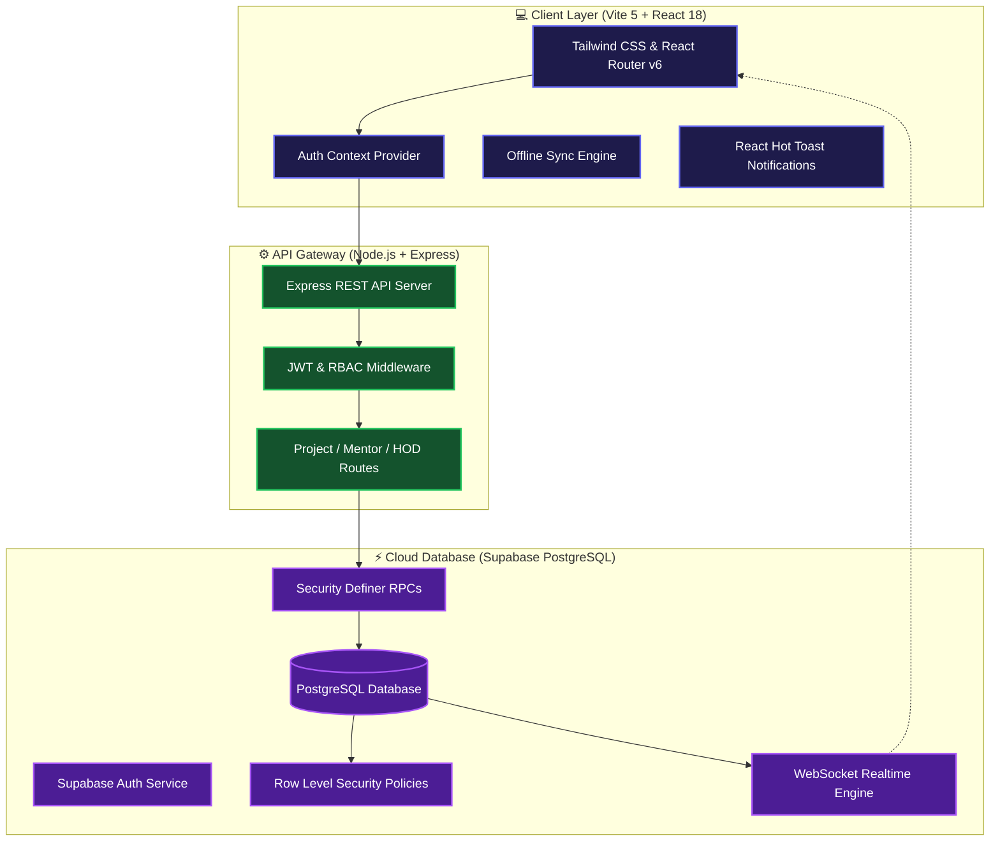
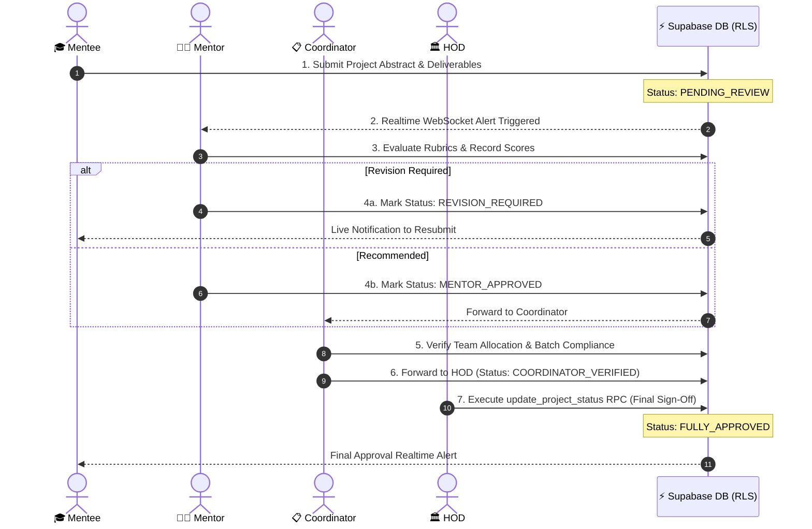

<div align="center">

<!-- Animated Main Header Banner -->


<br />

<!-- Animated Subtitle Typing Engine -->
<p align="center">
  
</p>

<!-- Technology Badges Row -->
<p align="center">
  
  
  
  
  
  
  
</p>

<!-- Repository Badges -->
<p align="center">
  <a href="https://github.com/Durgesh729/Multi-Tier-Academic-Workflow-with-RBAC/stargazers">
    
  </a>
  <a href="https://github.com/Durgesh729/Multi-Tier-Academic-Workflow-with-RBAC/network/members">
    
  </a>
  <a href="https://github.com/Durgesh729/Multi-Tier-Academic-Workflow-with-RBAC/issues">
    
  </a>
  <a href="https://github.com/Durgesh729/Multi-Tier-Academic-Workflow-with-RBAC/blob/main/LICENSE">
    
  </a>
</p>

<br />

<!-- Quick Navigation Bar -->
<p align="center">
  <a href="#-system-overview">Overview</a> •
  <a href="#-key-features--role-capabilities">Key Features & Animations</a> •
  <a href="#-system-architecture">Architecture</a> •
  <a href="#-academic-review-workflow">Interactive Workflow</a> •
  <a href="#-rbac-permission-matrix">RBAC Matrix</a> •
  <a href="#-technology-ecosystem">Technology Ecosystem</a> •
  <a href="#-quick-start--installation">Quick Start</a>
</p>

</div>

<br />

---

## 💡 System Overview

The **Multi-Tier Academic Workflow with RBAC** is a modern academic project governance system built to streamline student capstone evaluations across engineering departments and universities.

By replacing untracked spreadsheets and manual communications with a unified 4-tier operational engine (**Mentee ➔ Mentor ➔ Coordinator ➔ HOD**), the platform enforces standardized rubric grading, automated faculty mentor assignment, real-time WebSocket updates, and executive status overrides under zero-trust **Postgres Row Level Security (RLS)**.

---

## ✨ Key Features & Role Capabilities

Each user role is equipped with specialized tools and tailored workflows:

<br />

### 🎓 1. Mentee Workspace (Student Portal)

<div align="center">
  <!-- Dynamic Mentee Workspace Typing Animation -->
  
</div>

- **Proposal & Deliverable Submissions**: Upload abstracts, tech stacks, repository URLs, documentation PDFs, and presentation decks.
- **Team Roster Management**: Create project teams and invite student peers with automated validation.
- **Offline-First Synchronization**: Built-in `OfflineSyncProvider` caches draft updates locally and automatically pushes changes when internet connection is restored.
- **Realtime Status Feed**: Receive instant WebSocket alerts whenever mentors or coordinators evaluate work or request revisions.

<br />

### 👨‍🏫 2. Mentor Evaluation Suite (Faculty Guide)

<div align="center">
  <!-- Dynamic Mentor Evaluation Typing Animation -->
  
</div>

- **Assigned Teams Hub**: Access a centralized dashboard of all student groups under direct supervision.
- **Rubric-Based Evaluation**: Grade preliminary proposals, mid-term progress checks, and final project defenses against structured criteria.
- **Contextual Feedback Engine**: Provide line-item feedback, assign corrective action items, and request resubmissions.
- **Lifecycle Status Governance**: Advance project states through `Draft` ➔ `Submitted` ➔ `Under Review` ➔ `Revision Required` ➔ `Approved`.

<br />

### 📋 3. Project Coordinator Dashboard

<div align="center">
  <!-- Dynamic Coordinator Typing Animation -->
  
</div>

- **Academic Cycle Configuration**: Setup academic years, submission deadlines, and review milestone calendars.
- **Automated Mentor Allocation**: Distribute project teams among faculty members based on domain expertise and workload capacity.
- **Dynamic Feedback Links**: Generate secure submission links (`coordinator_feedback_links`) with real-time sync.
- **Departmental Compliance**: Track batch-level progress, completed evaluations, and pending reviews.

<br />

### 🏛️ 4. HOD Executive Suite (Head of Department)

<div align="center">
  <!-- Dynamic HOD Suite Typing Animation -->
  
</div>

- **Executive Analytics Hub**: Gain high-level visibility into project pass rates, domain distributions, and evaluation velocity.
- **RPC Status Override**: Execute `SECURITY DEFINER` RPC functions (`update_project_status`) for emergency overrides and final sign-offs.
- **Accreditation Reporting**: Export comprehensive audit reports for academic accreditation bodies (e.g., NAAC / NBA).

---

## 🏗️ System Architecture



---

## 🗺️ Academic Review Workflow



<br />

### 🔍 Interactive Workflow Phase Breakdown

<details>
<summary><b>🔹 Phase 1: Proposal Submission & Roster Check</b></summary>
<br />
Students submit project titles, abstracts, code repository links, and team member details. Submissions trigger an automatic database record insertion with initial state `PENDING_REVIEW` and emit WebSocket events to assigned mentors.
</details>

<details>
<summary><b>🔹 Phase 2: Mentor Rubric Grading & Action Items</b></summary>
<br />
Faculty mentors review project deliverables against standardized evaluation rubrics. Mentors can either request targeted revisions (setting state to `REVISION_REQUIRED`) or approve the project phase (setting state to `MENTOR_APPROVED`).
</details>

<details>
<summary><b>🔹 Phase 3: Coordinator Verification & Batch Auditing</b></summary>
<br />
Project Coordinators review team allocations, verify compliance with academic deadlines, and forward approved projects to the Head of Department with state `COORDINATOR_VERIFIED`.
</details>

<details>
<summary><b>🔹 Phase 4: HOD Executive Sign-off & RPC Execution</b></summary>
<br />
The Head of Department performs final executive audits. Approvals trigger the `SECURITY DEFINER` RPC function `update_project_status(p_project_id, 'FULLY_APPROVED')`, completing the review lifecycle.
</details>

---

## 🎭 RBAC Permission Matrix

<div align="center">

| Operational Capability | 🎓 Mentee | 👨‍🏫 Mentor | 📋 Coordinator | 🏛️ HOD |
| :--- | :---: | :---: | :---: | :---: |
| **Submit Proposal & Upload Artifacts** | ✅ | ❌ | ❌ | ❌ |
| **View Assigned Projects** | ✅ *(Own)* | ✅ *(Mentees)* | ✅ *(All)* | ✅ *(All)* |
| **Evaluate & Grade Rubrics** | ❌ | ✅ | ✅ | ✅ |
| **Allocate Faculty Mentors** | ❌ | ❌ | ✅ | ✅ |
| **Manage Academic Calendars** | ❌ | ❌ | ✅ | ✅ |
| **RPC Status Override** | ❌ | ❌ | ❌ | ✅ |
| **Department Audit Analytics** | ❌ | ❌ | ✅ | ✅ |

</div>

---

## 🚀 Technology Ecosystem

The platform is engineered using modern web technologies across four core layers:

<br />

### 🌐 Frontend Layer
<p>
  
  
  
  
  
</p>

### ⚙️ Backend API Gateway
<p>
  
  
  
  
</p>

### ⚡ Database & Cloud Security
<p>
  
  
  
  
</p>

### 🛠️ Developer Tooling
<p>
  
  
  
</p>

<br />

<div align="center">

| Ecosystem Layer | Technologies | Role & Impact |
| :--- | :--- | :--- |
| **User Interface** | `React 18` • `Vite 5` • `Tailwind CSS` | Ultra-fast SPA client with glassmorphism UI & responsive design |
| **State & Caching** | `Context API` • `Custom Hooks` | Client-side state management & offline synchronization engine |
| **API Gateway** | `Node.js` • `Express.js` • `JWT` | Server handling authentication, role routing, and email alerts |
| **Database Security** | `Supabase` • `PostgreSQL` • `RLS` | Zero-trust database policies & WebSocket realtime engine |

</div>

---

## 📂 Repository Layout

```
project-review-system/
├── 📁 backend/
│   ├── 📁 lib/                   # Supabase client singletons
│   ├── 📁 middleware/            # JWT authentication & RBAC middleware
│   ├── 📁 routes/                # REST API route handlers
│   │   ├── authRoutes.js         # User registration & role selection
│   │   ├── projectRoutes.js      # Project proposals & deliverables
│   │   ├── mentorRoutes.js       # Faculty evaluation & rubrics
│   │   ├── hodRoutes.js          # Executive analytics & RPC overrides
│   │   ├── contact.js            # Automated email notifications
│   │   └── files.js              # File attachment handlers
│   ├── database_setup.sql        # Supabase RLS policies, tables & RPC functions
│   └── server.js                 # Express application entry point
│
├── 📁 frontend/
│   ├── 📁 src/
│   │   ├── 📁 components/        # Role dashboards (Mentee, Mentor, HOD, Coordinator)
│   │   ├── 📁 contexts/          # Auth, AcademicYear & OfflineSync Contexts
│   │   ├── 📁 hooks/             # Custom React hooks
│   │   ├── App.jsx               # Main router & role guards
│   │   └── main.jsx              # Application bootstrap
│   ├── tailwind.config.js        # Design tokens
│   └── vite.config.js            # Vite build setup
```

---

## 🚀 Quick Start & Installation

### 📋 Prerequisites
* [Node.js](https://nodejs.org/) `>= 18.x`
* [npm](https://www.npmjs.com/) `>= 9.x`
* A free [Supabase Account](https://supabase.com/)

---

### 1️⃣ Clone Repository
```bash
git clone https://github.com/Durgesh729/Multi-Tier-Academic-Workflow-with-RBAC.git
cd Multi-Tier-Academic-Workflow-with-RBAC
```

---

### 2️⃣ Database Migration (Supabase)
1. Log into your [Supabase Dashboard](https://app.supabase.com/).
2. Open the **SQL Editor** tab.
3. Run the SQL script from [`backend/database_setup.sql`](file:///c:/Users/DURGESH%20PADVAL/Documents/project%20review%20system/backend/database_setup.sql) to create tables, RLS policies, and RPC functions.

---

### 3️⃣ Backend Environment & Server
```bash
cd backend
npm install
```

Create `.env` inside `backend/`:
```env
PORT=5000
SUPABASE_URL=https://your-supabase-project-id.supabase.co
SUPABASE_SERVICE_ROLE_KEY=your-supabase-service-role-key
JWT_SECRET=your-secret-jwt-key
EMAIL_USER=your-email@gmail.com
EMAIL_PASS=your-app-password
```

Start backend:
```bash
npm run dev
```

---

### 4️⃣ Frontend Environment & Web App
```bash
cd ../frontend
npm install
```

Create `.env` inside `frontend/`:
```env
VITE_SUPABASE_URL=https://your-supabase-project-id.supabase.co
VITE_SUPABASE_ANON_KEY=your-supabase-anon-key
VITE_API_BASE_URL=http://localhost:5000/api
```

Start frontend:
```bash
npm run dev
```

---

## 🔌 API Documentation Catalog

<details>
<summary><b>🔍 Click to Expand API Route Details</b></summary>

<br />

### 🔐 Authentication (`/api/auth`)
| Method | Endpoint | Access | Description |
| :--- | :--- | :--- | :--- |
| `POST` | `/signup` | Public | Register new account |
| `POST` | `/login` | Public | Authenticate user & receive session token |
| `POST` | `/select-role` | Authenticated | Assign primary role |

### 📁 Projects (`/api/projects`)
| Method | Endpoint | Access | Description |
| :--- | :--- | :--- | :--- |
| `GET` | `/` | Authenticated | List role-accessible projects |
| `POST` | `/` | Mentee | Create new project proposal |
| `PATCH` | `/:id/status` | Mentor / Coord / HOD | Update project status |
| `POST` | `/:id/deliverables` | Mentee | Upload project deliverables |

### 👨‍🏫 Mentor (`/api/mentor`)
| Method | Endpoint | Access | Description |
| :--- | :--- | :--- | :--- |
| `GET` | `/assigned-teams` | Mentor | View assigned student groups |
| `POST` | `/feedback` | Mentor | Submit rubric scores & feedback |

### 🏛️ HOD & Coordinator (`/api/hod`)
| Method | Endpoint | Access | Description |
| :--- | :--- | :--- | :--- |
| `GET` | `/analytics` | HOD / Coordinator | Get department metrics |
| `POST` | `/allocate-mentor` | Coordinator | Assign faculty mentor to team |
| `POST` | `/override-status` | HOD | Execute RPC status override |

</details>

---

## 🔒 Security & Row Level Security (RLS)

The system relies on Postgres RLS for database-enforced security:

```sql
-- RLS Policy: Coordinator full access
CREATE POLICY "Coordinator full access" ON coordinator_feedback_links
  FOR ALL USING (
    auth.uid() IN (
      SELECT id FROM users WHERE role = 'project_coordinator'
    )
  );

-- RPC Function: Safe status updates bypassing direct table mutations
CREATE OR REPLACE FUNCTION update_project_status(p_project_id UUID, p_status TEXT)
RETURNS VOID LANGUAGE plpgsql SECURITY DEFINER AS $$
BEGIN
  UPDATE projects SET status = p_status WHERE id = p_project_id;
END;
$$;
```

---

## 🤝 Contributing & License

Contributions are welcome! Please feel free to open a Pull Request.

Distributed under the **MIT License**.

<br />

<div align="center">

<p align="center">
  Crafted with ❤️ by <a href="https://github.com/Durgesh729"><b>Durgesh Padval</b></a>
</p>

<p align="center">
  <a href="#top"><b>⬆ Back to Top</b></a>
</p>

</div>
