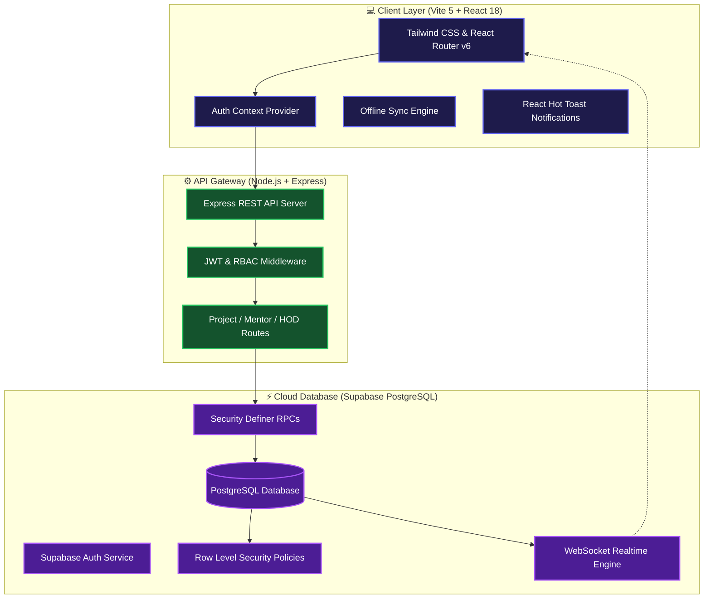
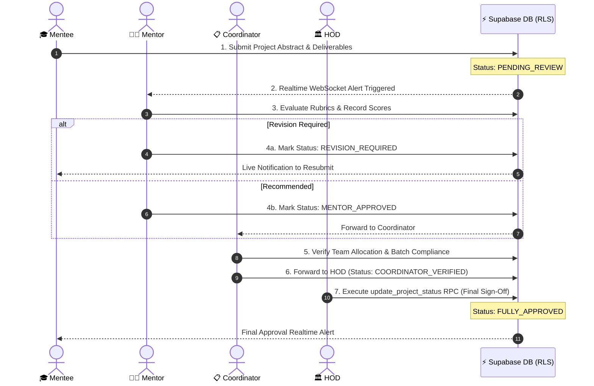

<div align="center">

<!-- Animated Header Banner -->


<br />

<!-- Animated Typing Subtitle -->
<p align="center">
  
</p>

<!-- Animated Shields & Badges Row -->
<p align="center">
  <a href="https://github.com/Durgesh729/Multi-Tier-Academic-Workflow-with-RBAC/stargazers">
    
  </a>
  <a href="https://github.com/Durgesh729/Multi-Tier-Academic-Workflow-with-RBAC/network/members">
    
  </a>
  <a href="https://github.com/Durgesh729/Multi-Tier-Academic-Workflow-with-RBAC/issues">
    
  </a>
  <a href="https://github.com/Durgesh729/Multi-Tier-Academic-Workflow-with-RBAC/blob/main/LICENSE">
    
  </a>
</p>

<!-- Technology Badges -->
<p align="center">
  
  
  
  
  
  
  
</p>

<br />

<!-- Quick Navigation Bar -->
<p align="center">
  <a href="#-system-overview">Overview</a> •
  <a href="#-key-features--role-capabilities">Key Features</a> •
  <a href="#-system-architecture">Architecture</a> •
  <a href="#-academic-review-workflow">Workflow</a> •
  <a href="#-rbac-permission-matrix">RBAC Matrix</a> •
  <a href="#-quick-start--installation">Quick Start</a> •
  <a href="#-api-documentation-catalog">API Catalog</a>
</p>

</div>

<br />

---

## 💡 System Overview

The **Multi-Tier Academic Workflow with RBAC** is a modern, enterprise-ready academic governance engine designed to automate the lifecycle of student capstone projects. 

By replacing messy spreadsheets and manual email chains with a unified **4-tier operational structure**, the platform provides transparent evaluation rubrics, automated mentor allocations, real-time WebSocket notifications, and executive HOD oversight—all backed by database-enforced **Row Level Security (RLS)**.

```
                  ┌──────────────────────────────────────────────┐
                  │    ACADEMIC PROJECT GOVERNANCE PLATFORM      │
                  └──────────────────────┬───────────────────────┘
                                         │
       ┌───────────────────┬─────────────┴─────────────┬───────────────────┐
       ▼                   ▼                           ▼                   ▼
 🎓 MENTEE           👨‍🏫 MENTOR                 📋 COORDINATOR       🏛️ HOD EXECUTIVE
┌──────────────┐    ┌──────────────┐          ┌──────────────┐     ┌──────────────┐
│ Submit Code  │    │ Grade Rubric │          │ Allocate     │     │ Final Audit  │
│ Deliverables │ ──►│ Provide Feed │ ───────► │ Mentors      │ ──► │ Executive    │
│ Live Status  │    │ Phase Status │          │ Batch Insights│    │ Sign-Off     │
└──────────────┘    └──────────────┘          └──────────────┘     └──────────────┘
```

---

## ✨ Key Features & Role Capabilities

<div align="center">
  <!-- Animated Typing Indicator for Key Features -->
  
</div>

<br />

### 🎓 1. Mentee Workspace (Student Portal)
- 📤 **Deliverable Management**: Upload project abstracts, github repositories, PDF documentation, and demo videos.
- 👥 **Team Formation Engine**: Form project groups and invite peers with validation checks.
- 🔄 **Offline-First Synchronization**: Built-in `OfflineSyncProvider` caches submissions locally and syncs automatically when connection restores.
- ⚡ **Realtime Feedback Tracker**: Instant push notifications via Supabase WebSockets whenever review feedback or status updates occur.

### 👨‍🏫 2. Mentor Evaluation Suite (Faculty Guide)
- 📊 **Assigned Teams Control Center**: View and manage all assigned student project groups in one clean interface.
- 📝 **Structured Rubric Grading**: Evaluate preliminary proposals, mid-term milestones, and final defenses against standardized rubrics.
- 💬 **Contextual Action-Item Feedback**: Provide actionable feedback and request targeted revisions.
- 🚦 **Lifecycle State Machine**: Progress project statuses through `Draft` ➔ `Submitted` ➔ `Under Review` ➔ `Revision Required` ➔ `Approved`.

### 📋 3. Project Coordinator Dashboard
- 🗓️ **Academic Cycle Management**: Configure academic years, deadlines, and evaluation milestone calendars.
- 🔀 **Smart Mentor Allocation**: Balance faculty workloads and match domain expertise with student team topics.
- 🔗 **Dynamic Feedback Links**: Generate unique, secure submission links (`coordinator_feedback_links`) with instant real-time sync.
- 📈 **Batch Level Compliance**: Track department-wide submission rates, pending reviews, and evaluation timelines.

### 🏛️ 4. HOD Executive Suite (Head of Department)
- 📊 **Executive Analytics Hub**: Gain high-level visibility into project pass rates, domain breakdown, and evaluation velocity.
- 🛡️ **RPC Status Override**: Execute `SECURITY DEFINER` RPC functions (`update_project_status`) for emergency overrides and final approvals.
- 📄 **Accreditation Reporting**: Export comprehensive audit reports for academic accreditation bodies (e.g., NAAC / NBA).

---

## 🏗️ System Architecture

<br />



---

## 🗺️ Academic Review Workflow



---

## 🎭 RBAC Permission Matrix

<div align="center">

| Operational Capability | 🎓 Mentee | 👨‍🏫 Mentor | 📋 Coordinator | 🏛️ HOD |
| :--- | :---: | :---: | :---: | :---: |
| **Submit Proposal & Upload Artifacts** | ✅ | ❌ | ❌ | ❌ |
| **View Assigned Projects** | ✅ *(Own)* | ✅ *(Mentees)* | ✅ *(All)* | ✅ *(All)* |
| **Evaluate & Grade Rubrics** | ❌ | ✅ | ✅ | ✅ |
| **Allocate Faculty Mentors** | ❌ | ❌ | ✅ | ✅ |
| **Manage Academic Calendars** | ❌ | ❌ | ✅ | ✅ |
| **RPC Status Override** | ❌ | ❌ | ❌ | ✅ |
| **Department Audit Analytics** | ❌ | ❌ | ✅ | ✅ |

</div>

---

## 🛠️ Technology Ecosystem

| Component | Technology | Role in Architecture |
| :--- | :--- | :--- |
| **Frontend Framework** | `React 18` + `Vite 5` | Ultra-fast single page application with Hot Module Replacement |
| **Styling & UI Components** | `Tailwind CSS` + `Lucide Icons` | Glassmorphic, responsive design system with clear visual hierarchy |
| **State & Offline Sync** | `Context API` + `Custom Hooks` | Local caching & offline synchronization engine |
| **Backend Runtime** | `Node.js` + `Express.js` | RESTful API gateway handling RBAC verification & email triggers |
| **Database & Security** | `Supabase` (PostgreSQL) | Managed database with strict Row Level Security (RLS) policies |
| **RPC Functions** | `PL/pgSQL` | `SECURITY DEFINER` functions for safe status overrides |

---

## 📂 Repository Layout

```
project-review-system/
├── 📁 backend/
│   ├── 📁 lib/                   # Supabase client singletons
│   ├── 📁 middleware/            # JWT authentication & RBAC middleware
│   ├── 📁 routes/                # REST API route handlers
│   │   ├── authRoutes.js         # User registration & role selection
│   │   ├── projectRoutes.js      # Project proposals & deliverables
│   │   ├── mentorRoutes.js       # Faculty evaluation & rubrics
│   │   ├── hodRoutes.js          # Executive analytics & RPC overrides
│   │   ├── contact.js            # Automated email notifications
│   │   └── files.js              # File attachment handlers
│   ├── database_setup.sql        # Supabase RLS policies, tables & RPC functions
│   └── server.js                 # Express application entry point
│
├── 📁 frontend/
│   ├── 📁 src/
│   │   ├── 📁 components/        # Role dashboards (Mentee, Mentor, HOD, Coordinator)
│   │   ├── 📁 contexts/          # Auth, AcademicYear & OfflineSync Contexts
│   │   ├── 📁 hooks/             # Custom React hooks
│   │   ├── App.jsx               # Main router & role guards
│   │   └── main.jsx              # Application bootstrap
│   ├── tailwind.config.js        # Design tokens
│   └── vite.config.js            # Vite build setup
```

---

## 🚀 Quick Start & Installation

### 📋 Prerequisites
* [Node.js](https://nodejs.org/) `>= 18.x`
* [npm](https://www.npmjs.com/) `>= 9.x`
* A free [Supabase Account](https://supabase.com/)

---

### 1️⃣ Clone & Install Dependencies
```bash
git clone https://github.com/Durgesh729/Multi-Tier-Academic-Workflow-with-RBAC.git
cd Multi-Tier-Academic-Workflow-with-RBAC
```

---

### 2️⃣ Database Setup (Supabase)
1. Create a project in [Supabase](https://app.supabase.com/).
2. Go to the **SQL Editor** tab.
3. Run the SQL script from [`backend/database_setup.sql`](file:///c:/Users/DURGESH%20PADVAL/Documents/project%20review%20system/backend/database_setup.sql) to create tables, RLS policies, and RPC functions.

---

### 3️⃣ Backend Launch
```bash
cd backend
npm install
```

Configure `.env` in `backend/`:
```env
PORT=5000
SUPABASE_URL=https://your-supabase-project-id.supabase.co
SUPABASE_SERVICE_ROLE_KEY=your-supabase-service-role-key
JWT_SECRET=your-secret-jwt-key
EMAIL_USER=your-email@gmail.com
EMAIL_PASS=your-app-password
```

Start backend:
```bash
npm run dev
```

---

### 4️⃣ Frontend Launch
```bash
cd ../frontend
npm install
```

Configure `.env` in `frontend/`:
```env
VITE_SUPABASE_URL=https://your-supabase-project-id.supabase.co
VITE_SUPABASE_ANON_KEY=your-supabase-anon-key
VITE_API_BASE_URL=http://localhost:5000/api
```

Start frontend:
```bash
npm run dev
```

---

## 🔌 API Documentation Catalog

<details>
<summary><b>🔍 Click to Expand API Route Details</b></summary>

<br />

### 🔐 Authentication (`/api/auth`)
| Method | Endpoint | Access | Description |
| :--- | :--- | :--- | :--- |
| `POST` | `/signup` | Public | Register new account |
| `POST` | `/login` | Public | Authenticate user & receive session token |
| `POST` | `/select-role` | Authenticated | Assign primary role |

### 📁 Projects (`/api/projects`)
| Method | Endpoint | Access | Description |
| :--- | :--- | :--- | :--- |
| `GET` | `/` | Authenticated | List role-accessible projects |
| `POST` | `/` | Mentee | Create new project proposal |
| `PATCH` | `/:id/status` | Mentor / Coord / HOD | Update project status |
| `POST` | `/:id/deliverables` | Mentee | Upload project deliverables |

### 👨‍🏫 Mentor (`/api/mentor`)
| Method | Endpoint | Access | Description |
| :--- | :--- | :--- | :--- |
| `GET` | `/assigned-teams` | Mentor | View assigned student groups |
| `POST` | `/feedback` | Mentor | Submit rubric scores & feedback |

### 🏛️ HOD & Coordinator (`/api/hod`)
| Method | Endpoint | Access | Description |
| :--- | :--- | :--- | :--- |
| `GET` | `/analytics` | HOD / Coordinator | Get department metrics |
| `POST` | `/allocate-mentor` | Coordinator | Assign faculty mentor to team |
| `POST` | `/override-status` | HOD | Execute RPC status override |

</details>

---

## 🔒 Security & Row Level Security (RLS)

The system relies on Postgres RLS for absolute security:

```sql
-- RLS Policy: Coordinator full access
CREATE POLICY "Coordinator full access" ON coordinator_feedback_links
  FOR ALL USING (
    auth.uid() IN (
      SELECT id FROM users WHERE role = 'project_coordinator'
    )
  );

-- RPC Function: Safe status updates bypassing direct table mutations
CREATE OR REPLACE FUNCTION update_project_status(p_project_id UUID, p_status TEXT)
RETURNS VOID LANGUAGE plpgsql SECURITY DEFINER AS $$
BEGIN
  UPDATE projects SET status = p_status WHERE id = p_project_id;
END;
$$;
```

---

## 🤝 Contributing & License

Contributions are welcome! Please feel free to open a Pull Request.

Distributed under the **MIT License**.

<br />

<div align="center">

<p align="center">
  Crafted with ❤️ by <a href="https://github.com/Durgesh729"><b>Durgesh Padval</b></a>
</p>

<p align="center">
  <a href="#top"><b>⬆ Back to Top</b></a>
</p>

</div>
