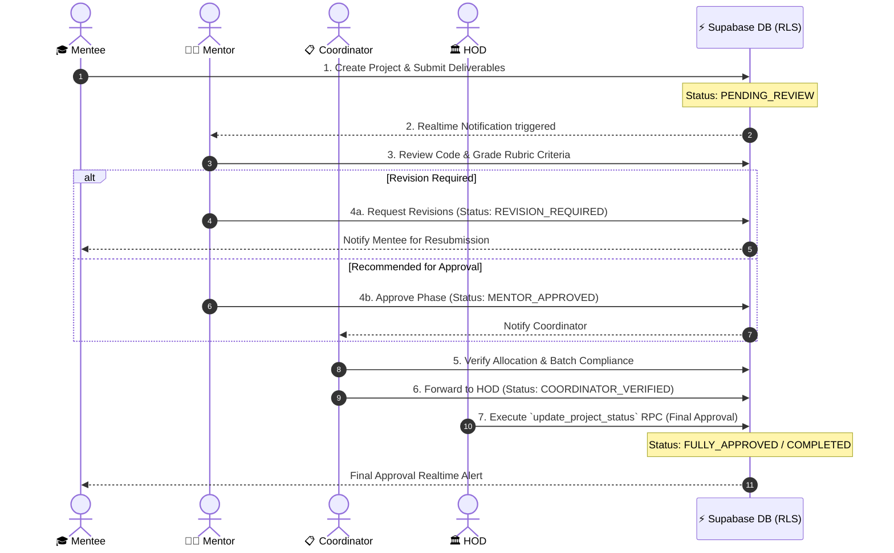

<div align="center">

<!-- Animated Header Banner -->


<p align="center">
  <b>A next-generation, enterprise-grade academic capstone project governance platform featuring 4-tier Role-Based Access Control (RBAC), real-time evaluations, offline sync, and automated workflows.</b>
</p>

<!-- Animated Badges & Shield Row -->
<p align="center">
  <a href="https://github.com/Durgesh729/Multi-Tier-Academic-Workflow-with-RBAC/stargazers">
    
  </a>
  <a href="https://github.com/Durgesh729/Multi-Tier-Academic-Workflow-with-RBAC/network/members">
    
  </a>
  <a href="https://github.com/Durgesh729/Multi-Tier-Academic-Workflow-with-RBAC/issues">
    
  </a>
  <a href="https://github.com/Durgesh729/Multi-Tier-Academic-Workflow-with-RBAC/blob/main/LICENSE">
    
  </a>
</p>

<!-- Tech Stack Badges -->
<p align="center">
  
  
  
  
  
  
  
  
</p>

---

<p align="center">
  <a href="#-overview">Overview</a> •
  <a href="#-key-features">Key Features</a> •
  <a href="#-rbac-architecture--tier-matrix">RBAC Matrix</a> •
  <a href="#-academic-review-workflow">Workflow</a> •
  <a href="#-system-architecture">Architecture</a> •
  <a href="#-quick-start">Quick Start</a> •
  <a href="#-api-documentation">API Catalog</a> •
  <a href="#-deployment-guide">Deployment</a>
</p>

</div>

<br />

---

## 💡 Overview

The **Multi-Tier Academic Workflow with RBAC** (Project Review System) revolutionizes capstone project management for universities, departments, and engineering institutes. 

Traditionally, tracking student projects, mentor allocations, evaluation rubrics, and HOD approvals involved fragmented spreadsheets, manual emails, and untracked progress updates. This platform unifies all stakeholders into a **single, secure, real-time workspace** governed by strict **Row Level Security (RLS)** and role-based operational permissions.

```
       ┌─────────────────────────────────────────────────────────────┐
       │             ACADEMIC PROJECT GOVERNANCE ENGINE              │
       └──────────────────────────────┬──────────────────────────────┘
                                      │
         ┌────────────────────────────┼────────────────────────────┐
         ▼                            ▼                            ▼
   🎓 MENTEES                   👨‍🏫 MENTORS                📋 COORDINATORS
 ┌─────────────────┐          ┌─────────────────┐        ┌─────────────────┐
 │ Submit Proposals│          │ Evaluate Rubrics│        │ Mentor Allocation│
 │ Upload Artifacts│ ───────► │ Provide Feedback│ ─────► │ Schedule Reviews│
 │ Realtime Status │          │ Grade Milestones│        │ Batch Analytics │
 └─────────────────┘          └─────────────────┘        └────────┬────────┘
                                                                  │
                                                                  ▼
                                                          🏛️ HOD EXECUTIVE
                                                         ┌─────────────────┐
                                                         │ Department Audit│
                                                         │ Final Sign-Off  │
                                                         │ Performance Metrics│
                                                         └─────────────────┘
```

---

## ✨ Key Features

### 🎓 **Mentee Workspace**
- 🚀 **Proposal & Deliverable Submission**: Submit project abstracts, tech stacks, repository URLs, documentation PDFs, and presentation decks.
- 👥 **Team Formation & Invitations**: Form project groups and invite team members with auto-validation.
- 🔄 **Offline-First Synchronization**: Built-in `OfflineSyncProvider` caches progress locally and syncs automatically when reconnected.
- 🔔 **Real-Time Notification Hub**: Live status updates via Supabase Realtime when mentors review or request revisions.

### 👨‍🏫 **Mentor Evaluation Suite**
- 📋 **Assigned Teams Dashboard**: Instant view of all student groups under direct mentorship.
- 📝 **Rubric-Based Grading**: Structured evaluation criteria for preliminary reviews, mid-term checks, and final project defenses.
- 💬 **Contextual Feedback Loop**: Inline comments and action-item tracking for team revisions.
- 🚦 **Status Lifecycle Governance**: Move projects across `Draft`, `Submitted`, `Under Review`, `Approved`, `Revision Required`, and `Completed`.

### 📋 **Project Coordinator Control Center**
- 🗓️ **Academic Year Management**: Create and configure academic cycles, submission deadlines, and evaluation phases.
- 🔀 **Automated Mentor Allocation**: Distribute project teams among faculty members balanced by domain expertise and workload.
- 🔗 **Feedback Link Generator**: Generate dynamic, secure submission links (`coordinator_feedback_links`) with real-time sync.
- 📊 **Batch Level Insights**: Comprehensive tracking of submitted vs pending project reviews across the entire department.

### 🏛️ **HOD Executive Dashboard**
- 📈 **Departmental Performance Analytics**: Real-time charts detailing project status distributions, mentor evaluation paces, and pass rates.
- 🛡️ **Executive Approval & Audit**: Inspect project histories, override statuses with SECURITY DEFINER RPC functions, and grant final sign-offs.
- 📄 **Exportable Reports**: Generate comprehensive PDF/CSV audit reports for accreditation bodies (e.g., NAAC, NBA).

---

## 🎭 RBAC Architecture & Tier Matrix

Security and operational boundaries are enforced at both the API level (Express Middlewares) and the database level (Supabase Row-Level Security Policies).

| Capabilities / Permissions | 🎓 Mentee | 👨‍🏫 Mentor | 📋 Coordinator | 🏛️ HOD |
| :--- | :---: | :---: | :---: | :---: |
| **Create Project Proposal** | ✅ | ❌ | ❌ | ❌ |
| **Upload Deliverables / Code** | ✅ | ❌ | ❌ | ❌ |
| **View Assigned Projects** | ✅ (Own) | ✅ (Mentees) | ✅ (All) | ✅ (All) |
| **Grade / Submit Review Feedback** | ❌ | ✅ | ✅ | ✅ |
| **Allocate Mentors to Teams** | ❌ | ❌ | ✅ | ✅ |
| **Manage Academic Years** | ❌ | ❌ | ✅ | ✅ |
| **Executive Status Override** | ❌ | ❌ | ❌ | ✅ |
| **Department Audit & Analytics** | ❌ | ❌ | ✅ | ✅ |

---

## 🗺️ Academic Review Workflow



---

## 🏗️ System Architecture

```mermaid
graph TD
    subgraph Client Layer (Vite + React 18)
        UI[Tailwind UI & React Router]
        AuthCtx[Auth Context]
        OfflineSync[Offline Sync Provider Engine]
        Toast[React Hot Toast Alerts]
    end

    subgraph API Gateway (Node.js + Express)
        Server[Express Server instance]
        AuthMW[JWT / Role Middleware]
        Routes[Project, Mentor, HOD, Contact & File Routes]
    end

    subgraph Database & Security (Supabase Cloud)
        AuthService[Supabase Auth Service]
        PG[(PostgreSQL Database)]
        RLS[Row Level Security Policies]
        RPC[Security Definer Functions]
        Realtime[Supabase Realtime Pub/Sub]
    end

    UI --> AuthCtx
    UI --> OfflineSync
    Client Layer -- REST API Requests --> Routes
    Routes --> AuthMW
    AuthMW --> RPC
    RPC --> PG
    AuthService -- Token Verification --> AuthMW
    PG --> RLS
    PG --> Realtime
    Realtime -- WebSocket Events --> UI
```

---

## 🛠️ Tech Stack & Ecosystem

<div align="center">

| Domain | Technology | Description |
| :--- | :--- | :--- |
| **Frontend Framework** | `React 18` + `Vite` | Ultra-fast HMR bundled single page application |
| **Styling & UI** | `Tailwind CSS` + `Lucide React` | Responsive glassmorphism aesthetic with accessible iconography |
| **State & Sync** | `Context API` + `Custom Hooks` | Lightweight global state & offline syncing middleware |
| **Backend Runtime** | `Node.js` + `Express.js` | RESTful API server handling business logic & auth routing |
| **Database** | `PostgreSQL` via `Supabase` | Relational storage with JSONB support & realtime webhooks |
| **Authentication** | `Supabase Auth` + `JWT` | Multi-role session management with OAuth & Magic Links |
| **Security Layer** | `Postgres RLS` + `RPC` | Database-enforced authorization policies for bulletproof security |
| **Mail Engine** | `Nodemailer` | Automated email notifications for review status updates |

</div>

---

## 📂 Repository Structure

```
project-review-system/
├── 📁 backend/
│   ├── 📁 lib/                   # Supabase client configurations
│   ├── 📁 middleware/            # RBAC verification & JWT auth middlewares
│   ├── 📁 models/                # Data structure schemas
│   ├── 📁 routes/                # Express API Route Handlers
│   │   ├── authRoutes.js         # User registration, login & role assignment
│   │   ├── projectRoutes.js      # Project CRUD, status updates & file attachments
│   │   ├── mentorRoutes.js       # Mentor team views & evaluation submissions
│   │   ├── hodRoutes.js          # Executive oversight & department analytics
│   │   ├── contact.js            # Contact form & automated email notifications
│   │   ├── deleteAccountRoutes.js# Account cleanup & soft-delete procedures
│   │   └── files.js              # Storage file upload handlers
│   ├── database_setup.sql        # Supabase RLS policies, tables & RPC functions
│   ├── server.js                 # Express application entrypoint
│   └── render.yaml               # Deployment configuration for Render
│
├── 📁 frontend/
│   ├── 📁 src/
│   │   ├── 📁 components/        # Dashboards (Mentee, Mentor, HOD, Coordinator)
│   │   ├── 📁 contexts/          # Auth, AcademicYear & OfflineSync Contexts
│   │   ├── 📁 hooks/             # Custom React hooks (useAuth, useOffline, etc.)
│   │   ├── 📁 layouts/           # Shared page wrappers & navigation bars
│   │   ├── 📁 lib/               # Frontend Supabase client singleton
│   │   ├── App.jsx               # React Router v6 complete route manifest
│   │   └── main.jsx              # React application bootstrapper
│   ├── tailwind.config.js        # Custom design system tokens
│   ├── vite.config.js            # Vite bundler options
│   └── vercel.json               # SPA rewrite configuration for Vercel
│
├── 📁 supabase/                  # Supabase CLI migrations & configuration
└── 📁 edge_functions/            # Serverless Edge functions for instant triggers
```

---

## 🚀 Quick Start

### 📋 Prerequisites
Ensure you have the following installed on your machine:
* [Node.js](https://nodejs.org/) `>= 18.x`
* [npm](https://www.npmjs.com/) `>= 9.x` or [yarn](https://yarnpkg.com/)
* [Git](https://git-scm.com/)
* A free [Supabase Account](https://supabase.com/)

---

### 1️⃣ Clone the Repository
```bash
git clone https://github.com/Durgesh729/Multi-Tier-Academic-Workflow-with-RBAC.git
cd Multi-Tier-Academic-Workflow-with-RBAC
```

---

### 2️⃣ Database Setup (Supabase)
1. Log in to your [Supabase Dashboard](https://app.supabase.com/) and create a new project.
2. Navigate to the **SQL Editor** tab.
3. Copy the contents of [`backend/database_setup.sql`](file:///c:/Users/DURGESH%20PADVAL/Documents/project%20review%20system/backend/database_setup.sql) and execute the query to set up tables, RLS policies, and RPC functions.

---

### 3️⃣ Backend Setup & Configuration
```bash
cd backend
npm install
```

Create a `.env` file inside the `backend/` directory:
```env
PORT=5000
SUPABASE_URL=https://your-supabase-project-id.supabase.co
SUPABASE_SERVICE_ROLE_KEY=your-supabase-service-role-key
JWT_SECRET=your-super-secret-jwt-key
EMAIL_USER=your-email@gmail.com
EMAIL_PASS=your-app-password
```

Start the Express development server:
```bash
npm run dev
```
> Server will be running at `http://localhost:5000` 🚀

---

### 4️⃣ Frontend Setup & Configuration
Open a new terminal tab:
```bash
cd frontend
npm install
```

Create a `.env` file inside the `frontend/` directory:
```env
VITE_SUPABASE_URL=https://your-supabase-project-id.supabase.co
VITE_SUPABASE_ANON_KEY=your-supabase-anon-key
VITE_API_BASE_URL=http://localhost:5000/api
```

Start the Vite web app:
```bash
npm run dev
```
> Frontend will be running at `http://localhost:5173` ⚡

---

## 🔌 API Documentation

<details>
<summary><b>🔍 View Full API Catalog & Routes</b></summary>

<br />

### 🔐 Authentication (`/api/auth`)
| Method | Endpoint | Access | Description |
| :--- | :--- | :--- | :--- |
| `POST` | `/signup` | Public | Register new account with role request |
| `POST` | `/login` | Public | Authenticate user & issue session token |
| `POST` | `/select-role` | Authenticated | Assign primary role (`mentee`, `mentor`, `project_coordinator`, `hod`) |

### 📁 Projects (`/api/projects`)
| Method | Endpoint | Access | Description |
| :--- | :--- | :--- | :--- |
| `GET` | `/` | Authenticated | List projects filtered by user role & RLS |
| `POST` | `/` | Mentee | Create a new project proposal |
| `GET` | `/:id` | Authenticated | Fetch project details, deliverables & timeline |
| `PATCH` | `/:id/status` | Mentor / Coord / HOD | Update project review status |
| `POST` | `/:id/deliverables` | Mentee | Upload project milestone attachments |

### 👨‍🏫 Mentor (`/api/mentor`)
| Method | Endpoint | Access | Description |
| :--- | :--- | :--- | :--- |
| `GET` | `/assigned-teams` | Mentor | Retrieve all student teams assigned to mentor |
| `POST` | `/feedback` | Mentor | Submit review scores, comments & action items |

### 🏛️ HOD & Coordinator (`/api/hod`)
| Method | Endpoint | Access | Description |
| :--- | :--- | :--- | :--- |
| `GET` | `/analytics` | HOD / Coordinator | Fetch department-wide project statistics |
| `POST` | `/allocate-mentor` | Coordinator | Assign a faculty mentor to a project team |
| `POST` | `/override-status` | HOD | Execute RPC function to override project status |

</details>

---

## 🔒 Security & Row Level Security (RLS)

This application adheres to zero-trust database principles:

1. **Row Level Security (RLS)**: Tables like `coordinator_feedback_links` and `projects` use explicit Postgres policies:
   ```sql
   -- Public read policy for mentees
   CREATE POLICY "Public read access" ON coordinator_feedback_links
       FOR SELECT USING (true);

   -- Coordinator access control policy
   CREATE POLICY "Coordinator full access" ON coordinator_feedback_links
       FOR ALL USING (
           auth.uid() IN (
               SELECT id FROM users WHERE role = 'project_coordinator'
           )
       );
   ```
2. **Security Definer RPCs**: Status updates bypass direct mutation tables safely using encapsulated RPC functions:
   ```sql
   CREATE OR REPLACE FUNCTION update_project_status(p_project_id UUID, p_status TEXT)
   RETURNS VOID LANGUAGE plpgsql SECURITY DEFINER AS $$
   BEGIN
     UPDATE projects SET status = p_status WHERE id = p_project_id;
   END;
   $$;
   ```

---

## 🌐 Deployment Guide

### ⚡ Frontend (Vercel)
[](https://vercel.com/new)
1. Push your repository to GitHub.
2. Import your repository into Vercel.
3. Set Root Directory to `frontend`.
4. Add environment variables (`VITE_SUPABASE_URL`, `VITE_SUPABASE_ANON_KEY`, `VITE_API_BASE_URL`).
5. Deploy!

### 🚀 Backend (Render)
[](https://render.com)
1. Create a new **Web Service** on Render connected to your repository.
2. Set Root Directory to `backend`.
3. Build Command: `npm install`
4. Start Command: `npm start`
5. Configure environment variables from `backend/.env`.

---

## 🤝 Contributing

Contributions make the open-source community an incredible place to learn, inspire, and create. Any contributions you make are **greatly appreciated**!

1. **Fork** the Repository (`https://github.com/Durgesh729/Multi-Tier-Academic-Workflow-with-RBAC/fork`)
2. **Create** your Feature Branch (`git checkout -b feature/AmazingFeature`)
3. **Commit** your Changes (`git commit -m 'Add some AmazingFeature'`)
4. **Push** to the Branch (`git push origin feature/AmazingFeature`)
5. **Open** a Pull Request

---

## 📝 License

Distributed under the **MIT License**. See [`LICENSE`](LICENSE) for more information.

<br />

<div align="center">

<p align="center">
  Crafted with ❤️ by <a href="https://github.com/Durgesh729"><b>Durgesh Padval</b></a>
</p>

<p align="center">
  <a href="#top"><b>⬆ Back to Top</b></a>
</p>

</div>
